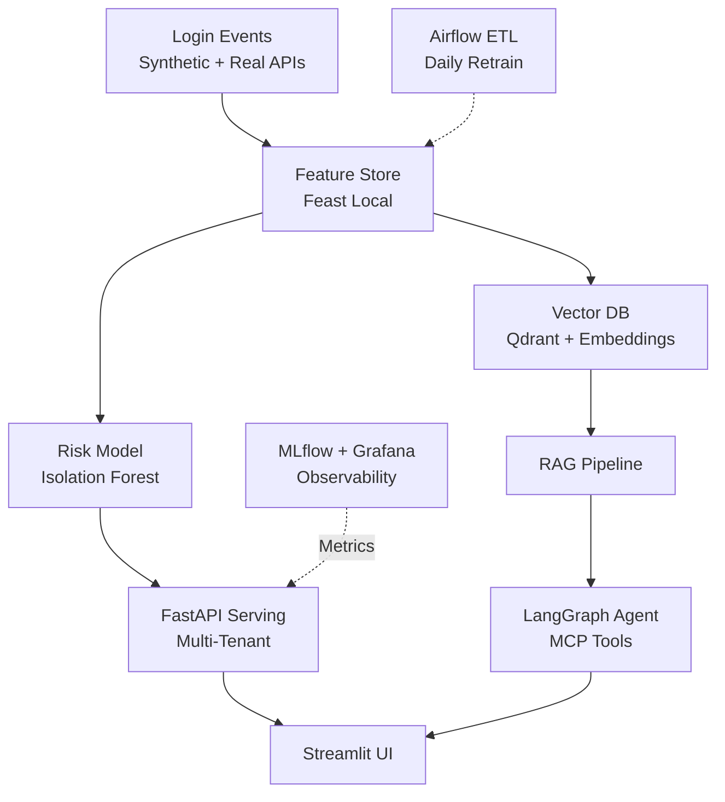

<div align="center">

# 🔐 Identity Risk Agent Platform

[](https://github.com/vijay-prabhu/identity-risk-agent/actions)
[](https://identity-risk-agent.vercel.app)
[](https://python.org)

**Production-grade ML + GenAI infrastructure for secure, multi-tenant identity risk analysis.**

*Full-stack MLOps platform powering real-time risk scoring, explainable RAG, and autonomous security agents.*

</div>

---

## 🎯 Problem Solved

Modern identity platforms need **scalable ML infrastructure** to power:
- Real-time risk scoring for login events
- Explainable decisions via RAG
- Autonomous security agents with tool access
- Multi-tenant isolation + privacy compliance

**This project implements the complete platform**, from raw event ingestion to production deployment.

---

## 🏗️ Architecture Overview



---

## 🚀 Features & Enterprise Patterns

| Feature | Status | Tech |
|---------|--------|------|
| **Multi-Tenant Isolation** | 🔲 Phase 2 | Qdrant namespaces + API middleware |
| **Privacy & PII Redaction** | 🔲 Phase 3 | Presidio + audit logs |
| **Real-Time Risk Scoring** | 🔲 Phase 1 | scikit-learn + Feast online |
| **RAG Explanations** | 🔲 Phase 3 | sentence-transformers + Ollama |
| **Autonomous Agents** | 🔲 Phase 3 | LangGraph + MCP tools |
| **Production Orchestration** | 🔲 Phase 4 | Airflow + CI/CD gates |
| **Observability** | 🔲 Phase 4 | MLflow + Grafana |

---

## 📋 Quickstart

```bash
git clone https://github.com/vijay-prabhu/identity-risk-agent
cd identity-risk-agent

# Install & run
pip install -r requirements.txt
make dev  # FastAPI + Streamlit

# Full stack (Phase 4)
docker-compose up  # + Airflow/MLflow/Grafana

# Tests + quality gates
make test
make test-model-gate  # Fail if AUC < 0.85
```

---

## 🧠 Architecture Decisions

| Decision | Why It Matters |
|----------|----------------|
| [Feature Store (Feast)](docs/adrs/001-feature-store.md) | Online/offline consistency |
| [Multi-Tenant Design](docs/adrs/003-multi-tenant.md) | Enterprise isolation |
| [LLM Provider](docs/adrs/002-llm-provider.md) | Cost/latency/privacy balance |
| [Agent Runtime](docs/adrs/004-agent-runtime.md) | Scalable GenAI infra |
| [Testing Gates](docs/adrs/006-testing.md) | ML quality assurance |

---

## 🛠️ Tech Stack

```
Data:        pandas, Faker, ipapi.co (real IP intel)
ML:          scikit-learn, sentence-transformers
Infra:       Feast, MLflow, Airflow, FastAPI
GenAI:       LangGraph, Qdrant, Ollama
Deploy:      Docker, Vercel/Render, GitHub Actions
Observability: Grafana, Prometheus
Testing:     pytest, Great Expectations
```

**All free-tier compatible.**

---

## 📂 Project Structure

```
identity-risk-agent/
├── api/                     # FastAPI application
├── ui/                      # Streamlit dashboard
├── src/
│   ├── core/                # MVP scoring logic
│   ├── features/            # Feature engineering
│   ├── models/              # Training/evaluation
│   ├── agents/              # RAG + LangGraph
│   ├── tools/               # MCP-like APIs
│   └── privacy/             # PII detection/redaction
├── data/                    # Synthetic data + schemas
├── notebooks/               # Phase-wise Jupyter notebooks
├── tests/                   # Test suite
├── docs/adrs/               # Architecture Decision Records
└── .github/workflows/       # CI/CD pipelines
```

---

## 📈 Target Metrics

| Metric | Target |
|--------|--------|
| Synthetic events | 10k logins |
| Model AUC | > 0.85 |
| Agent latency | < 2s p95 |
| Test coverage | 80%+ |

---

## 🎯 Relevant For

| Role Type | Key Skills Demonstrated |
|-----------|------------------------|
| **ML Platform Engineer** | Feature stores, orchestration, CI/CD |
| **GenAI Infrastructure** | Agents, RAG, MCP patterns |
| **Security ML Engineer** | Multi-tenant, privacy, risk scoring |
| **MLOps Engineer** | Quality gates, observability |

---

## License

MIT
