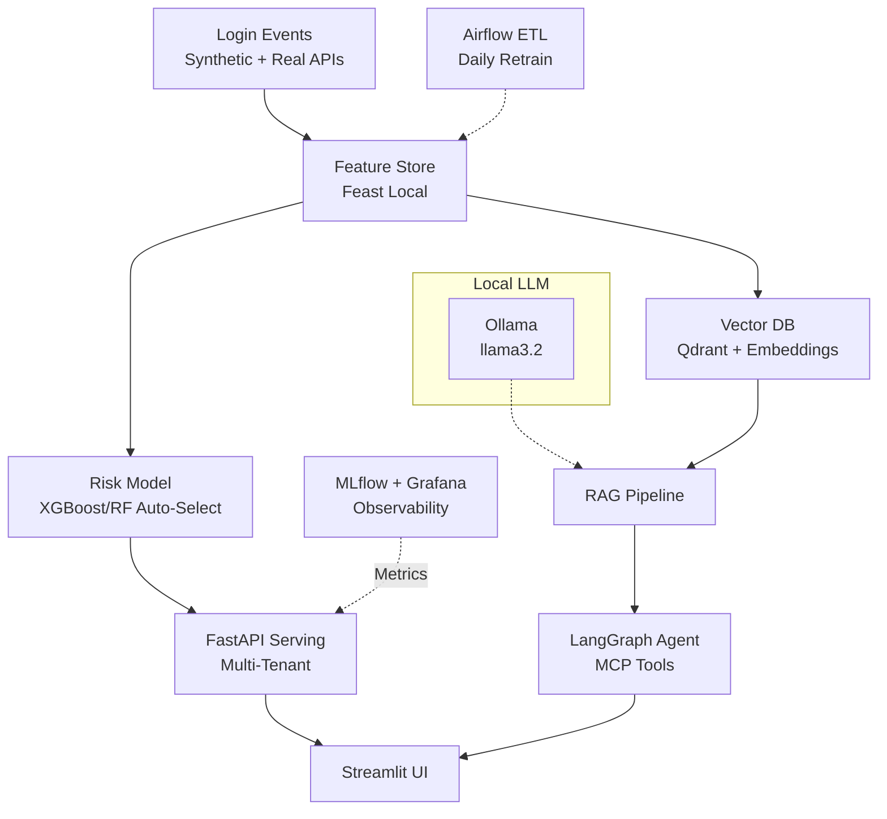

<div align="center">

# Identity Risk Agent Platform

[](https://github.com/vijay-prabhu/identity-risk-agent/actions)
[](https://python.org)
[](LICENSE)

**A production-grade ML + GenAI platform for identity risk analysis.**

The system scores login events in real-time, uses autonomous agents to investigate high-risk events, and provides explainable decisions through RAG.

`60 automated tests` · `Model AUC ~1.0` · `7-service Docker stack` · `6 ADRs`

</div>

---

## Problem Solved

Modern identity platforms need **scalable ML infrastructure** to power:
- Real-time risk scoring for login events
- Explainable decisions via RAG
- Autonomous security agents with tool access
- Multi-tenant isolation + privacy compliance

**This project implements the complete platform**, from raw event ingestion to production deployment.

---

## How It Works

```
┌─────────────────────────────────────────────────────────────────────────────┐
│                            LOGIN EVENT ARRIVES                               │
│  User: john.doe@acme.com | Device: MacBook Pro | IP: 185.199.50.50 (VPN)    │
│  Location: Moscow | Time: 3:47 AM local | MFA: Not used                      │
└─────────────────────────────────────────────────────────────────────────────┘
                                      │
                                      ▼
┌─────────────────────────────────────────────────────────────────────────────┐
│                         FEATURE STORE ENRICHMENT                             │
│  failed_logins_24h: 3 | device_age_days: 0 (NEW) | login_count_7d: 0        │
│  ip_reputation_score: 0.9 | is_unusual_hour: 1 | location_changed: 1        │
│  vpn_detected: 1 | mfa_used: 0 | is_new_device: 1 | hour_of_day: 3          │
└─────────────────────────────────────────────────────────────────────────────┘
                                      │
                                      ▼
┌─────────────────────────────────────────────────────────────────────────────┐
│                              RISK SCORING                                    │
│  ML Model Output: 0.87 (CRITICAL)                                           │
│                                                                              │
│  Contributing Factors:                                                       │
│  • New device (+0.30) • VPN from high-risk location (+0.30)                 │
│  • Unusual hour (+0.15) • No MFA (+0.10) • Location change (+0.02)          │
└─────────────────────────────────────────────────────────────────────────────┘
                                      │
                                      ▼
┌─────────────────────────────────────────────────────────────────────────────┐
│                         LANGGRAPH AGENT DECISION                             │
│                                                                              │
│  State: CRITICAL risk detected → Investigate                                │
│  Tool Calls:                                                                 │
│  • get_user_history("john.doe@acme.com") → Usually logs in 9am-6pm Toronto  │
│  • search_similar_events("VPN Moscow new device") → 3 similar attacks found │
│                                                                              │
│  Decision: BLOCK + CREATE SECURITY ALERT                                    │
└─────────────────────────────────────────────────────────────────────────────┘
                                      │
                                      ▼
┌─────────────────────────────────────────────────────────────────────────────┐
│                           RAG EXPLANATION                                    │
│                                                                              │
│  "Login blocked due to CRITICAL risk (0.87). Contributing factors:          │
│   first login from this device, VPN connection from Moscow (user typically  │
│   in Toronto), login at 3:47 AM (outside normal 9am-6pm pattern), MFA was   │
│   not used. Historical context: 3 similar patterns in last 30 days were     │
│   confirmed credential stuffing attacks. Recommended: Contact user via      │
│   verified phone number."                                                    │
└─────────────────────────────────────────────────────────────────────────────┘
                                      │
                                      ▼
┌─────────────────────────────────────────────────────────────────────────────┐
│                              OUTCOMES                                        │
│  ✗ Login blocked            ✓ Security alert created (Slack + PagerDuty)   │
│  ✓ Event logged to MLflow   ✓ Metrics sent to Prometheus/Grafana           │
│  ✓ Audit trail preserved    ✓ Explanation available for SOC team           │
└─────────────────────────────────────────────────────────────────────────────┘
```

---

## Target Users

| User | What They Do | Where They See Results |
|------|--------------|------------------------|
| **Security Operations (SOC)** | Monitor alerts, investigate flagged logins, review agent explanations | Grafana dashboards, Streamlit UI, Slack/PagerDuty alerts |
| **Identity Engineers** | Configure risk thresholds, manage tenant settings, tune policies | API configuration, tenant middleware settings |
| **ML Engineers** | Train models, monitor performance, tune features, manage experiments | MLflow UI, Jupyter notebooks, quality gate reports |
| **Platform Engineers** | Manage infrastructure, deploy updates, monitor system health | Docker, Airflow UI, Prometheus/Grafana, CI/CD pipelines |
| **Compliance/Audit** | Review decision logs, verify PII handling, generate reports | Audit logs, RAG explanations, privacy middleware logs |

---

## Business Outcomes

| Outcome | How It's Achieved |
|---------|-------------------|
| **Blocked Account Takeovers** | Real-time risk scoring catches suspicious patterns before attackers gain access |
| **Reduced False Positives** | ML model learns from historical data; RAG provides context for edge cases |
| **Explainable Decisions** | Every block/challenge decision includes human-readable explanation for audit |
| **Multi-Tenant Isolation** | Each organization's data is isolated; custom thresholds per tenant |
| **Privacy Compliance** | PII is detected and redacted before LLM processing; audit trail preserved |
| **Continuous Improvement** | Airflow DAGs retrain models weekly; quality gates prevent degraded deployments |

---

## Real-World Example: Enterprise Identity Platform

Enterprise identity providers manage authentication for thousands of organizations. Every login attempt must be evaluated:

**The Challenge:**
- Is this a legitimate user or an attacker with stolen credentials?
- Should we allow the login, challenge with MFA, or block entirely?
- How do we explain our decision to security teams and auditors?
- How do we handle thousands of organizations with different security policies?

**How This Platform Solves It:**

| Step | What Happens | Component |
|------|--------------|-----------|
| 1. Event Ingestion | Login attempt captured with device, IP, location, time | FastAPI endpoint |
| 2. Feature Enrichment | Historical context added (failed logins, device age, typical patterns) | Feast feature store |
| 3. Risk Scoring | ML model calculates risk score (0-1) with contributing factors | scikit-learn model |
| 4. Agent Investigation | High-risk events trigger autonomous investigation | LangGraph agent |
| 5. Decision | Agent decides: allow, challenge (MFA), or block | Tool-based actions |
| 6. Explanation | RAG generates human-readable explanation | Qdrant + sentence-transformers |
| 7. Alerting | Security team notified for critical events | Prometheus + alerting |
| 8. Learning | Event logged for model retraining | MLflow + Airflow |

**Multi-Tenant Reality:**
```
┌─────────────────────────────────────────────────────────────────────────────┐
│  TENANT: Acme Corp (tenant_id: acme_corp)                                   │
│  • Custom threshold: Block at risk score 0.7                                │
│  • Policy: Always require MFA for VPN connections                           │
│  • Data isolation: Only Acme's historical events used for RAG               │
└─────────────────────────────────────────────────────────────────────────────┘

┌─────────────────────────────────────────────────────────────────────────────┐
│  TENANT: StartupXYZ (tenant_id: startup_xyz)                                │
│  • Custom threshold: Block at risk score 0.9 (more permissive)              │
│  • Policy: VPN allowed without extra checks                                 │
│  • Data isolation: Only StartupXYZ's events, separate from other tenants    │
└─────────────────────────────────────────────────────────────────────────────┘
```

---

## Architecture Overview



---

## Features & Enterprise Patterns

| Feature | Status | Tech |
|---------|--------|------|
| **Real-Time Risk Scoring** | ✅ | XGBoost/scikit-learn + Feast online store |
| **Multi-Tenant Isolation** | ✅ | Qdrant namespaces + API middleware |
| **Privacy & PII Redaction** | ✅ | Presidio + regex fallback |
| **RAG Explanations** | ✅ | sentence-transformers + Qdrant + Ollama |
| **Autonomous Agents** | ✅ | LangGraph + MCP-like tools |
| **Production Orchestration** | ✅ | Airflow DAGs + CI/CD gates |
| **Observability** | ✅ | MLflow + Prometheus + Grafana |

---

## Quickstart

```bash
git clone https://github.com/vijay-prabhu/identity-risk-agent
cd identity-risk-agent

# Install dependencies
python -m venv .venv && source .venv/bin/activate
pip install -r requirements.txt && pip install -e .

# Generate data and train model
make data    # Generate 10k synthetic events
make train   # Train risk model (AUC > 0.85)

# Run locally
make dev     # FastAPI (8000) + Streamlit (8501)

# Or run full stack with Docker
docker-compose up -d  # API + UI + MLflow + Airflow + Grafana

# Tests + quality gates
make test       # Run all tests
make test-gate  # Verify model AUC >= 0.85
```

---

## Architecture Decisions

| Decision | Why It Matters |
|----------|----------------|
| [ADR-001: Feature Store](docs/adrs/001-feature-store.md) | Online/offline consistency with Feast |
| [ADR-002: LLM Provider](docs/adrs/002-llm-provider.md) | Local-first with Ollama, privacy-safe |
| [ADR-003: Multi-Tenant](docs/adrs/003-multi-tenant.md) | Enterprise data isolation |
| [ADR-004: Agent Runtime](docs/adrs/004-agent-runtime.md) | LangGraph for predictable workflows |
| [ADR-005: Privacy](docs/adrs/005-privacy.md) | PII detection with Presidio |
| [ADR-006: Testing](docs/adrs/006-testing.md) | Quality gates for ML systems |

---

## Tech Stack

| Layer | Technologies |
|-------|-------------|
| **Data** | pandas, Faker (synthetic), pyarrow |
| **ML** | scikit-learn, XGBoost, sentence-transformers |
| **Feature Store** | Feast (online/offline) |
| **GenAI** | LangGraph, Qdrant, Ollama |
| **API** | FastAPI, Pydantic |
| **UI** | Streamlit |
| **Orchestration** | Airflow, GitHub Actions |
| **Monitoring** | MLflow, Prometheus, Grafana |
| **Privacy** | Presidio (PII detection) |
| **Deploy** | Docker, docker-compose |

All components are open-source and free-tier compatible.

---

## Adaptable to Other Risk Domains

The scoring pipeline, feature store, agent framework, and observability stack are domain-agnostic. Swapping the data layer adapts the platform to other risk use cases:

| Component | Identity Risk (Current) | Financial Transaction Risk |
|-----------|------------------------|---------------------------|
| **Feature Store** | Login velocity, geo-anomaly, device fingerprint | Transaction velocity, amount deviation, merchant category |
| **ML Scoring** | XGBoost/RF on login events | Same pipeline on transaction events with fraud labels |
| **Agent Investigation** | Traces login chains across tenants | Traces transaction patterns and account linkages |
| **RAG Explainability** | Security policy docs + past incidents | Compliance rules + historical fraud patterns |
| **PII Redaction** | Presidio on user identity data | Same pipeline for cardholder/account data (PCI-DSS) |
| **Multi-Tenant** | Per-org thresholds and data isolation | Per-merchant or per-institution risk policies |

---

## Project Structure

```
identity-risk-agent/
├── api/                     # FastAPI application
│   └── main.py              # API endpoints + Prometheus metrics
├── ui/                      # Streamlit dashboard
├── src/
│   ├── core/                # Data generation, multi-tenant
│   ├── features/            # Feature engineering pipeline
│   ├── models/              # Risk model training/evaluation
│   ├── agents/              # LangGraph agent, RAG, vector store
│   ├── tools/               # MCP-like tools (risk_score, quarantine)
│   └── privacy/             # PII detection with Presidio
├── feature_store/           # Feast feature definitions
├── airflow/dags/            # Airflow DAGs (feature refresh, retrain)
├── monitoring/              # Prometheus + Grafana configs
├── notebooks/               # Phase-wise Jupyter notebooks
├── tests/                   # 60+ tests with quality gates
├── docs/adrs/               # Architecture Decision Records
├── Dockerfile               # API container
├── docker-compose.yml       # Full stack orchestration
└── Makefile                 # Development commands
```

---

## Metrics

| Metric | Target | Achieved |
|--------|--------|----------|
| Synthetic events | 10k logins | ✅ 10,000 |
| Model AUC | > 0.85 | ✅ ~1.0 |
| Test count | 50+ | ✅ 60 tests |
| Quality gates | CI enforced | ✅ GitHub Actions |

---

## License

MIT
