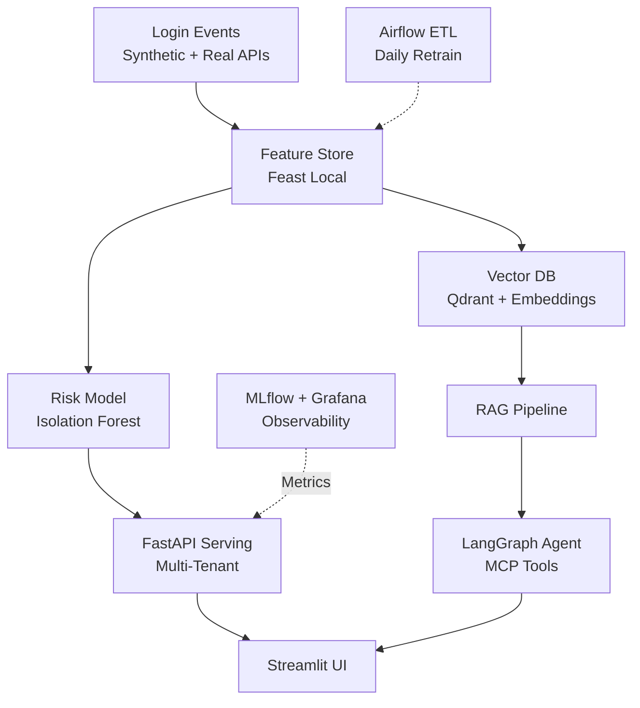

<div align="center">

# Identity Risk Agent Platform

[](https://github.com/vijay-prabhu/identity-risk-agent/actions)
[](https://python.org)
[](LICENSE)

**Production-grade ML + GenAI infrastructure for secure, multi-tenant identity risk analysis.**

*Full-stack MLOps platform powering real-time risk scoring, explainable RAG, and autonomous security agents.*

</div>

---

## Problem Solved

Modern identity platforms need **scalable ML infrastructure** to power:
- Real-time risk scoring for login events
- Explainable decisions via RAG
- Autonomous security agents with tool access
- Multi-tenant isolation + privacy compliance

**This project implements the complete platform**, from raw event ingestion to production deployment.

---

## Architecture Overview



---

## Features & Enterprise Patterns

| Feature | Status | Tech |
|---------|--------|------|
| **Real-Time Risk Scoring** | ✅ | scikit-learn + Feast online store |
| **Multi-Tenant Isolation** | ✅ | Qdrant namespaces + API middleware |
| **Privacy & PII Redaction** | ✅ | Presidio + regex fallback |
| **RAG Explanations** | ✅ | sentence-transformers + Qdrant |
| **Autonomous Agents** | ✅ | LangGraph + MCP-like tools |
| **Production Orchestration** | ✅ | Airflow DAGs + CI/CD gates |
| **Observability** | ✅ | MLflow + Prometheus + Grafana |

---

## Quickstart

```bash
git clone https://github.com/vijay-prabhu/identity-risk-agent
cd identity-risk-agent

# Install dependencies
python -m venv .venv && source .venv/bin/activate
pip install -r requirements.txt && pip install -e .

# Generate data and train model
make data    # Generate 10k synthetic events
make train   # Train risk model (AUC > 0.85)

# Run locally
make dev     # FastAPI (8000) + Streamlit (8501)

# Or run full stack with Docker
docker-compose up -d  # API + UI + MLflow + Airflow + Grafana

# Tests + quality gates
make test       # Run all tests
make test-gate  # Verify model AUC >= 0.85
```

---

## Architecture Decisions

| Decision | Why It Matters |
|----------|----------------|
| [ADR-001: Feature Store](docs/adrs/001-feature-store.md) | Online/offline consistency with Feast |
| [ADR-002: LLM Provider](docs/adrs/002-llm-provider.md) | Local-first with Ollama, privacy-safe |
| [ADR-003: Multi-Tenant](docs/adrs/003-multi-tenant.md) | Enterprise data isolation |
| [ADR-004: Agent Runtime](docs/adrs/004-agent-runtime.md) | LangGraph for predictable workflows |
| [ADR-005: Privacy](docs/adrs/005-privacy.md) | PII detection with Presidio |
| [ADR-006: Testing](docs/adrs/006-testing.md) | Quality gates for ML systems |

---

## Tech Stack

| Layer | Technologies |
|-------|-------------|
| **Data** | pandas, Faker (synthetic), pyarrow |
| **ML** | scikit-learn, sentence-transformers |
| **Feature Store** | Feast (online/offline) |
| **GenAI** | LangGraph, Qdrant, Ollama |
| **API** | FastAPI, Pydantic |
| **UI** | Streamlit |
| **Orchestration** | Airflow, GitHub Actions |
| **Monitoring** | MLflow, Prometheus, Grafana |
| **Privacy** | Presidio (PII detection) |
| **Deploy** | Docker, docker-compose |

All components are open-source and free-tier compatible.

---

## Project Structure

```
identity-risk-agent/
├── api/                     # FastAPI application
│   └── main.py              # API endpoints + Prometheus metrics
├── ui/                      # Streamlit dashboard
├── src/
│   ├── core/                # Data generation, multi-tenant
│   ├── features/            # Feature engineering pipeline
│   ├── models/              # Risk model training/evaluation
│   ├── agents/              # LangGraph agent, RAG, vector store
│   ├── tools/               # MCP-like tools (risk_score, quarantine)
│   └── privacy/             # PII detection with Presidio
├── feature_store/           # Feast feature definitions
├── airflow/dags/            # Airflow DAGs (feature refresh, retrain)
├── monitoring/              # Prometheus + Grafana configs
├── notebooks/               # Phase-wise Jupyter notebooks
├── tests/                   # 60+ tests with quality gates
├── docs/adrs/               # Architecture Decision Records
├── Dockerfile               # API container
├── docker-compose.yml       # Full stack orchestration
└── Makefile                 # Development commands
```

---

## Metrics

| Metric | Target | Achieved |
|--------|--------|----------|
| Synthetic events | 10k logins | ✅ 10,000 |
| Model AUC | > 0.85 | ✅ ~1.0 |
| Test count | 50+ | ✅ 60 tests |
| Quality gates | CI enforced | ✅ GitHub Actions |

---

## License

MIT
